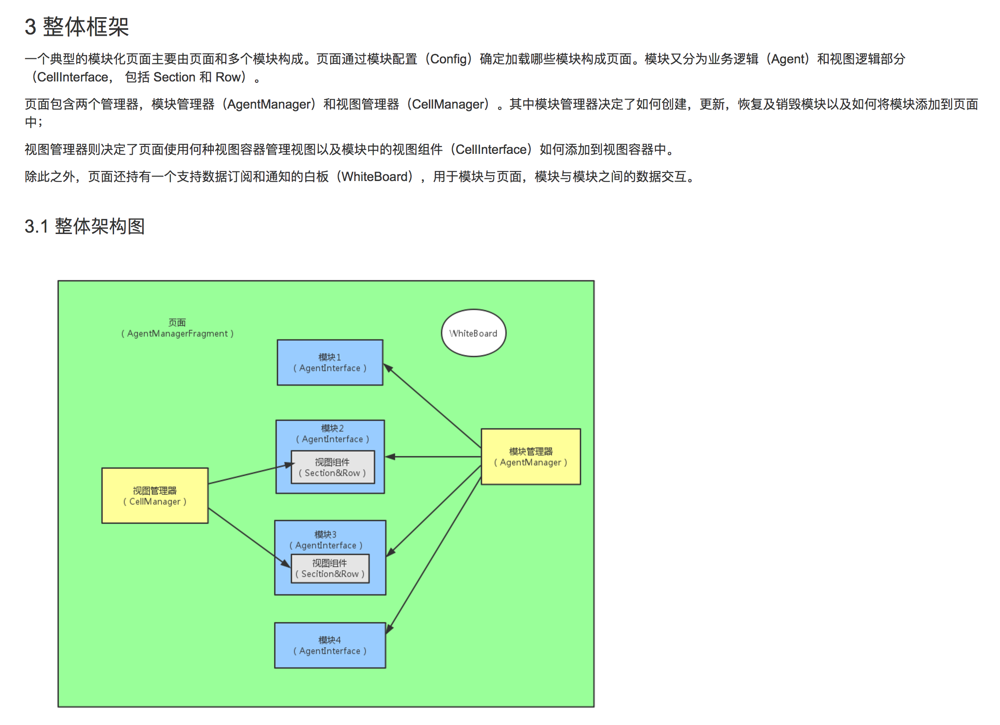

# 20170710~20170714
---
### 20170710

==今日工作总结==

1. 学习wiki上的开发代码规范，阅读Android开发学习总结文档。
2. 阅读文档结合项目源代码学习项目的代码结构。
3. 中午项目组搬家，换到了一个宽敞的办公环境。
4. 阅读项目的部分源代码，了解相关实现。

==明日工作计划==

1. 继续阅读源代码，了解项目实现过程。
2. 阅读Android新人指导文档。

==问题与总结==

1. wiki上有很多同学总结的一些Android相关的文档，写的都非常细致，有助于提高Android开发技能。
2. 由于对整个项目的结构和实现原理还不是很理解，阅读源码时有很多地方不是很理解。先整体熟悉，部分地方可能需要找mentor一起交流理解。
3. 点评的nova项目使用prepare插件来实现依赖配置，怎么实现的还没怎么看懂。美团的在setting.gradle中配置，两种配置啊有什么区别？
4. 点评的模块化开发框架大概理解了，但是项目中怎么实现的还看不太懂。

下图中说模块分为Agent和CellInterface两种，但是上下文中的模块都像是指Agent，而视图组件并未归纳到所谓的 “模块” 中 (**视图组件是可在不同模块间进行复用的视图逻辑集合，一般称作ViewCell，典型的视图组件是一个Section&Row结构**).

***********************

